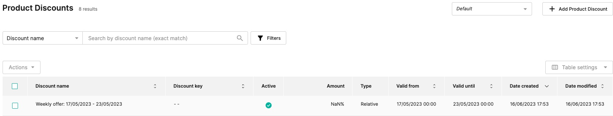
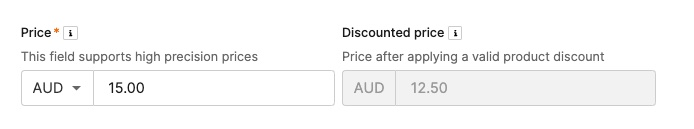
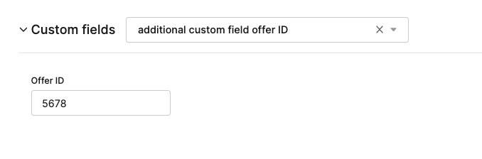

# Metro60/Milkrun Weekly Offers in commercetools PoC


## Overview


## Solution

The provide nodejs script is very easy to read. 

Most of the logic happens in the_ index.js.

ct-productDiscount.js and ct-product.js are leveraging commercetools javascript SDK to create discount and load/update product.

Other files are sample CSV with offers, “offers-15_06_2023-30_06_2023.csv” .env with the API Client and some configuration (see below) and step1.json file with the API call to make the required data model changes.


### Step I: Data Model 

Step one requires making minor data model changes by creating new field, **OfferId**, on  Product Price type.


### 
**POST Create Type**

https://api.{region}.commercetools.com//types

**Payload:**
```json
{

 "key": "price-offerID",

 "name": {

   "en": "Offer ID for Metro60"

 },

 "resourceTypeIds": [

   "product-price"

 ],

 "fieldDefinitions": [

   {

     "type": {

       "name": "String"

     },

     "name": "offerId",

     "label": {

       "en": "Offer ID"

     },

     "required": false,

     "inputHint": "SingleLine"

   }

 ]

}
```

This will allow to store unique offers IDs on the the product price that is discounted.

The above json data is saved in the **step1.json** file.

The **key** and name are required in the script _.env_ file


```
CUSTOM_PRICE_TYPE_KEY=price-offerID
CUSTOM_PRICE_FIELD_KEY=offerId
```


### Step II: Creating Product Discount

We need to create a single product discount for the weekly offers. 

For the purpose of this PoC I assumed the weekly offers are stored in single CSV file that can be titled with the date range e.g.


```
'offers-17_05_2023-23_05_2023.csv'
```


The script will parse the file name and extract the dates range to create one product discount for the entire week:





The dates are stored in the discount object:


Extract from the code creating the discount:


```
const dates = extractDates(inputPath);

       let validFrom = dates.validFrom;
       let validUntil= dates.validUntil;
       let name = "Weekly offer: " + dates.dateFrom + " - " +dates.dateUntil;


       const discount = await createProductDiscount({name,validFrom,validUntil});
       productDiscountId = discount.body.id;
```


The **productDiscountId** is important for applying the external discount on the price in the next steps.


### Step III: Updating Price with type and field

For every line in the CSV file with offers we take the Product Number as a Product Key in commercetools and we use it to update price row with additional custom field created above:


```
{
               action: "setProductPriceCustomType",
               priceId : priceId,
               typeKey : process.env.CUSTOM_PRICE_TYPE_KEY
             }
```


With the same API call we can also update the offer ID from the read from the CSV file:


```
{
               action : "setProductPriceCustomField",
               priceId : priceId,
               name : process.env.CUSTOM_PRICE_FIELD_KEY,
               value : offerId
             }
```


### Successful output

After running the example CSV the console prints log with the offers and price row ids with calculated discounted price

Offer 1234 was sucessfully set on Price 76d08e22-29cd-4671-b56d-d4b6ecb72b7f with discounted price 960

Offer 5678 was sucessfully set on Price da4f7ba8-d5f6-4e2e-9259-dda48b00d12e with discounted price 1250

Offer 9123 was sucessfully set on Price 5d0ac535-c3c9-404b-a0b7-968fcc6db151 with discounted price 400

With Marchant Centre in commercetools the discount is visible on the price row together with the offer id in custom fields:








### Step IV.

Final step is to set the discounted price on the price row.

Since it requires the actual value, rather than discount itself, the calculation of discounted price has to happen before:


```
const priceValue = ctProduct.masterData.staged.masterVariant.prices[0].value.centAmount;
   const offerDiscount = row.Vendor_Fund_Scan_Back *100;

   const discountedValue = priceValue - offerDiscount;
```


The final action is to set it on the price:


```
{
               action : "setDiscountedPrice",
               priceId : priceId,
               staged : true,
               discounted : {
                 value : {
                   currencyCode : process.env.CURRENCY,
                   centAmount : discounteValue
                 },
                 discount : {
                   typeId : "product-discount",
                   id : productDiscountId
                 }
               }
             }
```


All above actions can be handled in single API call to update the product with provided key.


## Limitations & Enhancements

Overall

There are many enhancements that can be done to make this production ready service.

E.g. reading the file automatically from repository, turing each CSV line into event and processing it as a serverless function from a queue etc.

Below are just some limitations of the script to make it run in any commercetools project.


### Product Discount:

Product Discount sortOdrer has to be unique - in the PoC script it is fixed in the .env file.

Solution: increment the value based on the previous discount - stored in a separate configuration file.
